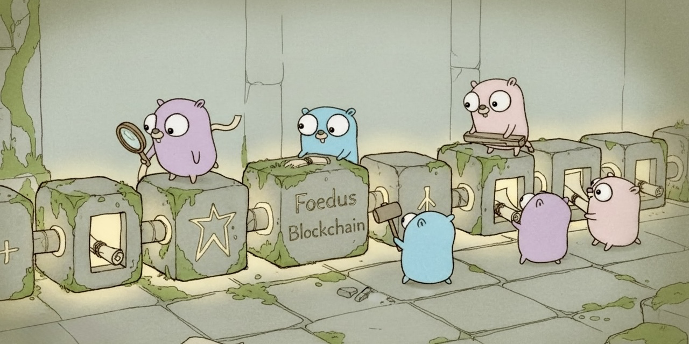

# Foedus Blockchain



<p align="center">
  <strong>Immutable Contract Infrastructure for Enterprise</strong>
</p>

<p align="center">
  <a href="#features">Features</a> •
  <a href="#quick-start">Quick Start</a> •
  <a href="#api-reference">API</a> •
  <a href="#smart-contracts">Contracts</a> •
  <a href="#deployment">Deploy</a>
</p>

<p align="center">
  
  
  
  
  
</p>

---

## Overview

Foedus is a **production-ready blockchain platform** enabling governments and enterprises to create, manage, and enforce immutable contracts. Built for legislative compliance and corporate accountability, it provides tamper-proof records with full audit trails.

**Built for:**
- 🏛️ **Government Bodies** enforcing legislative contracts and public agreements
- 🏢 **Enterprises** requiring legally binding, immutable contract records
- ⚖️ **Regulatory Compliance** with transparent, auditable contract histories
- 🤝 **Public-Private Partnerships** coordinating multi-party agreements

---

## Features

### 📜 Immutable Contract Records
Every contract, amendment, and approval is permanently recorded on the blockchain. Once committed, records cannot be altered or deleted—ensuring absolute integrity for legal and regulatory purposes.

### 🏛️ Multi-Party Governance
Support for multiple signatories including government agencies, corporate entities, and authorized representatives. All parties must cryptographically approve before contracts become active.

### 📋 Milestone-Based Execution
Track contract fulfillment through defined milestones. Each completion requires evidence submission and multi-party approval, creating a verifiable chain of accountability.

### 🔐 Cryptographic Security
Ed25519 digital signatures and SHA-256 hashing ensure non-repudiation. Every action is cryptographically signed, providing legally defensible proof of authorization.

### 📊 Complete Audit Trail
Full transaction history accessible for regulatory audits, legal discovery, and compliance verification. Export complete blockchain records on demand.

### 🚀 Enterprise Deployment
Production-ready Docker deployment with health monitoring, graceful shutdown, and persistent storage. Integrates with existing government and enterprise infrastructure via RESTful API.

---

## Quick Start

### Docker (Recommended)

```bash
# Pull and run
docker pull codila125/foedus-blockchain:latest
docker run -d -p 3000:3000 --name foedus codila125/foedus-blockchain:latest

# Verify it's running
curl http://localhost:3000/health
# {"status":"ok"}
```

### With Persistent Storage

```bash
docker volume create foedus-data
docker volume create foedus-logs

docker run -d \
  --name foedus \
  -p 3000:3000 \
  -p 8006:8006 \
  -p 8007:8007 \
  -v foedus-data:/app/data \
  -v foedus-logs:/var/log/foedus \
  codila125/foedus-blockchain:0.4.0
```

### Build from Source

```bash
git clone https://github.com/codila125/foedus-blockchain.git
cd foedus-blockchain
docker build -t foedus-blockchain .
docker run -d -p 3000:3000 --name foedus foedus-blockchain
```

---

## API Reference

Base URL: `http://localhost:3000`

### Health Check
```
GET /health
```
Returns `{"status":"ok"}` when service is operational.

### Wallet Operations

| Endpoint | Method | Description |
|----------|--------|-------------|
| `/blockchain/createwallet` | GET | Generate new wallet |
| `/blockchain/listaddresses` | GET | List all wallet addresses |
| `/blockchain/getbalance/{address}` | GET | Get wallet balance |

### Smart Contract Operations

| Endpoint | Method | Description |
|----------|--------|-------------|
| `/blockchain/createcontract/{address}` | POST | Create new contract |
| `/blockchain/getcontract/{contractID}` | GET | Get contract details |
| `/blockchain/approvecontract` | POST | Approve contract |
| `/blockchain/approvemilestone` | POST | Complete milestone |
| `/blockchain/cancelcontract` | POST | Cancel contract |

### Blockchain Queries

| Endpoint | Method | Description |
|----------|--------|-------------|
| `/blockchain/printchain` | GET | Export full blockchain |

---

## Smart Contracts

### Create a Contract

```bash
curl -X POST http://localhost:3000/blockchain/createcontract/{creator_address} \
  -H "Content-Type: application/json" \
  -d '{
    "title": "Infrastructure Development Agreement",
    "description": "Public-private partnership for highway construction",
    "milestones": [
      {
        "title": "Phase 1: Land Acquisition",
        "description": "Complete land acquisition and permits",
        "value": 5000000,
        "due_date": 1762329600
      },
      {
        "title": "Phase 2: Construction",
        "description": "Complete primary construction",
        "value": 25000000,
        "due_date": 1793865600
      }
    ],
    "parties": [
      {"address": "{government_agency}", "role": "REGULATOR"},
      {"address": "{contractor}", "role": "CONTRACTOR"},
      {"address": "{oversight_body}", "role": "ARBITRATOR"}
    ],
    "terms": "Funds released upon milestone approval by all parties"
  }'
```

### Contract Lifecycle

```
DRAFT → ACTIVE → COMPLETED
   ↓       ↓
   └───────┴──→ CANCELLED
```

1. **DRAFT**: Contract proposed, awaiting party approvals
2. **ACTIVE**: All authorized signatories approved, milestones in progress
3. **COMPLETED**: All milestones fulfilled and verified
4. **CANCELLED**: Contract terminated with full audit record

### Use Cases

| Sector | Application |
|--------|-------------|
| **Government** | Legislative contracts, procurement agreements, inter-agency MOUs |
| **Infrastructure** | Public-private partnerships, construction milestones |
| **Healthcare** | Pharmaceutical supply contracts, compliance agreements |
| **Finance** | Regulatory filings, audit trails, cross-border agreements |
| **Energy** | Power purchase agreements, environmental compliance |

---

## Deployment

### Environment Variables

| Variable | Default | Description |
|----------|---------|-------------|
| `NODE_ID` | `3000` | API server port |
| `SOURCE_NODE_ID` | `3000` | Source node identifier |
| `MINER_NODE_ID` | `3001` | Miner node identifier |

### Ports

| Port | Service |
|------|---------|
| `3000` | HTTP API |
| `8006` | P2P Source Node |
| `8007` | P2P Miner Node |

### Health Checks

Docker health checks are built-in:
```bash
# Check container health
docker inspect --format='{{.State.Health.Status}}' foedus
```

### Logs

```bash
# View logs
docker logs -f foedus

# Access log files (if using volumes)
docker exec foedus cat /var/log/foedus/source.log
```

---

## Architecture

```
┌─────────────────────────────────────────────────────────┐
│                      HTTP API (Chi)                     │
│              GET/POST /blockchain/*                     │
└───────────────────────┬─────────────────────────────────┘
                        │
┌───────────────────────┴─────────────────────────────────┐
│                   Blockchain Core                       │
│     UTXO Model • Proof-of-Work • Smart Contracts        │
└───────────────────────┬─────────────────────────────────┘
                        │
┌───────────────────────┴─────────────────────────────────┐
│                   Infrastructure                        │
│       libp2p Network • PebbleDB • Ed25519 Crypto        │
└─────────────────────────────────────────────────────────┘
```

---

## Technical Specifications

| Component | Technology |
|-----------|------------|
| Consensus | Proof-of-Work (SHA-256) |
| Signatures | Ed25519 |
| Storage | PebbleDB (LSM-tree) |
| Networking | libp2p (TCP) |
| Serialization | Protocol Buffers v3 |
| API Framework | Chi Router |

---

## Module Documentation

| Module | Description |
|--------|-------------|
| [api/](api/) | RESTful HTTP server |
| [blockchain/](blockchain/) | Core consensus engine |
| [network/](network/) | P2P communication |
| [wallet/](wallet/) | Key management |
| [database/](database/) | Storage layer |
| [merkle/](merkle/) | Transaction verification |
| [cli/](cli/) | Command-line interface |

---

## Support

- **Documentation**: [GitHub Wiki](https://github.com/codila125/foedus-blockchain/wiki)
- **Issues**: [GitHub Issues](https://github.com/codila125/foedus-blockchain/issues)
- **Docker Hub**: [codila125/foedus-blockchain](https://hub.docker.com/r/codila125/foedus-blockchain)
- **Enterprise Inquiries**: Contact for dedicated support and custom deployments

---

## License

MIT License - see [LICENSE](LICENSE) for details.

---

<p align="center">
  <strong>Foedus v0.4.0</strong> — Immutable Contract Infrastructure for Government & Enterprise
</p>
